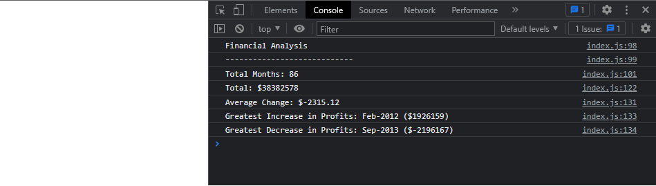

# WK4 Challenge: Finance challenge
week 4 challenge - Javascript

## Description

 
This project is to create code for analyzing the financial records of a company. With the financial data provided.
Some of the acceptance criteria for this project:

* The total number of months included in the dataset.
* The net total amount of Profit/Losses over the entire period.
* The average of the **changes** in Profit/Losses over the entire period.
* The greatest increase in profits (date and amount) over the entire period.
* The greatest decrease in losses (date and amount) over the entire period.

Website: https://lapworthaaron.github.io/week4_challenge/
 Repository: https://github.com/LapworthAaron/week4_challenge

Having learnt Javascript 18yrs ago and used numerous languages since, i'm familiar with all the concepts, but have had to refamiliarise myself with JS and Arrays syntax.

## Table of Contents (Optional)

- [Installation](#installation)
- [Usage](#usage)
- [Credits](#credits)
- [License](#license)

## Installation

Install folder structure as is, into your root directory, then you're good to go.

## Usage

This project has no special usage instructions, it's a simple website.

## Credits

© 2022 Aaron Lapworth. Confidential and Proprietary. All Rights Reserved.

## License

MIT License

Copyright (c) 2022 Aaron Lapworth

Permission is hereby granted, free of charge, to any person obtaining a copy
of this software and associated documentation files (the "Software"), to deal
in the Software without restriction, including without limitation the rights
to use, copy, modify, merge, publish, distribute, sublicense, and/or sell
copies of the Software, and to permit persons to whom the Software is
furnished to do so, subject to the following conditions:

The above copyright notice and this permission notice shall be included in all
copies or substantial portions of the Software.

THE SOFTWARE IS PROVIDED "AS IS", WITHOUT WARRANTY OF ANY KIND, EXPRESS OR
IMPLIED, INCLUDING BUT NOT LIMITED TO THE WARRANTIES OF MERCHANTABILITY,
FITNESS FOR A PARTICULAR PURPOSE AND NONINFRINGEMENT. IN NO EVENT SHALL THE
AUTHORS OR COPYRIGHT HOLDERS BE LIABLE FOR ANY CLAIM, DAMAGES OR OTHER
LIABILITY, WHETHER IN AN ACTION OF CONTRACT, TORT OR OTHERWISE, ARISING FROM,
OUT OF OR IN CONNECTION WITH THE SOFTWARE OR THE USE OR OTHER DEALINGS IN THE
SOFTWARE.